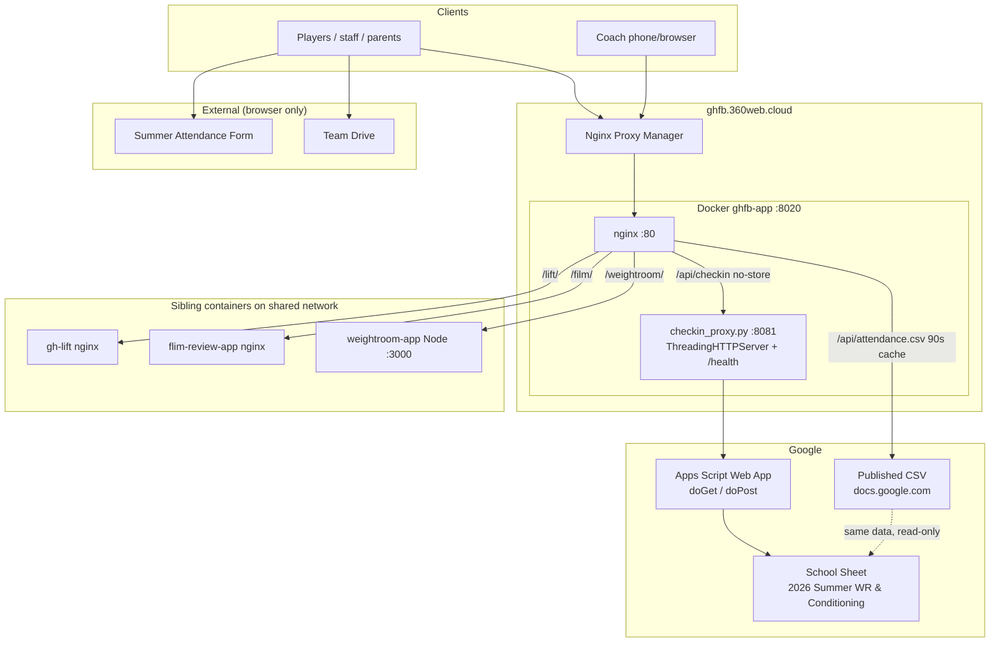
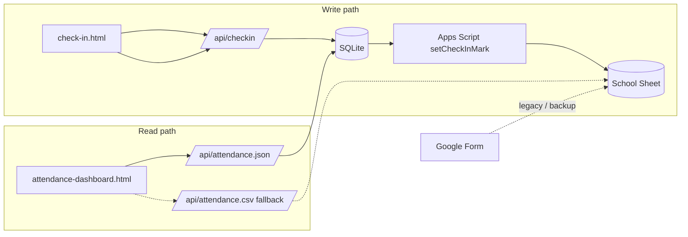

# System architecture

One VPS app (`ghfb-app`) serves static pages, proxies attendance CSV from Google Sheets, and proxies coach check-in to a **personal-account Apps Script** web app that writes the **school spreadsheet**.

## High-level diagram

## Data authority

| Path | Role |
|------|------|
| **SQLite (`/data/attendance.db`)** | Source of truth for roster, sessions, and marks |
| **Coach check-in** | Fast tap-list; writes DB, syncs sheet in background |
| **Attendance dashboard** | Reads `/api/attendance.json`; CSV is fallback only |
| **Google Form** | Still linked from hub as alternate entry |

The dashboard reads the DB directly (short cache). Check-in writes are immediate in SQLite; the sheet may lag briefly while the sync outbox drains. Full DB docs: [flows-attendance-db.md](./flows-attendance-db.md).

## Container runtime

On start, `/opt/start-ghfb.sh`:

1. Runs `python3 /opt/checkin_proxy.py` in the background (port **8081**).
2. Runs `nginx -g "daemon off;"` (port **80**).

| Process | Config |
|---------|--------|
| nginx | `deploy/nginx.conf`, `deploy/cache.conf` |
| Check-in proxy | `deploy/checkin_proxy.py`, env `CHECKIN_SCRIPT_URL` (defaults to deployed `/exec` URL) |

Host mapping: NPM proxy host `ghfb.360web.cloud` → `ghfb-app:80` on Docker network `360ws-network`, published as host port **8020**.

See [flows-deploy.md](./flows-deploy.md) for CI and one-time VPS setup.
