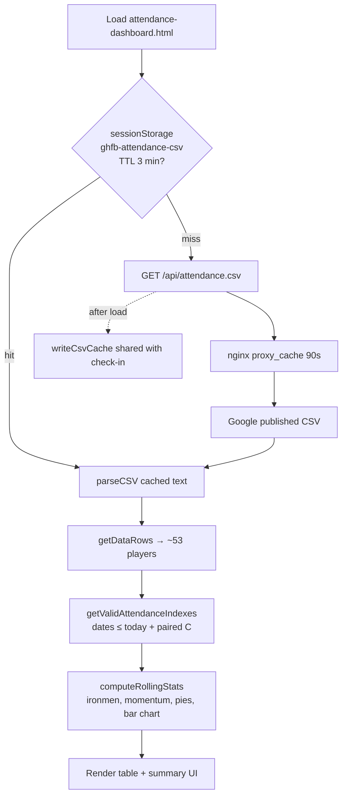

# Flow: Attendance dashboard

`attendance-dashboard.html` is **read-only**. It loads the published summer attendance CSV and computes rolling stats in the browser.

Entry: https://ghfb.360web.cloud/attendance-dashboard.html  
Script: `js/attendance-dashboard.js` (ES module) with `shared/ghfb-csv.js`, `shared/ghfb-attendance.js`, `shared/ghfb-dom.js`.

## Load flow

## nginx CSV proxy

| Setting | Value |
|---------|--------|
| Route | `/api/attendance.csv` |
| Upstream | Google Sheets `pub?output=csv` (see `deploy/nginx.conf`) |
| Server cache | 90s (`proxy_cache ghfb_attendance`) |
| Response header | `X-GHFB-Cache` (HIT/MISS/BYPASS) |
| Browser | `Cache-Control: public, max-age=60` |

## UI outputs

| Section | Logic source |
|---------|----------------|
| Total players | Roster row count after filters |
| Top rolling attendance | Max rolling % among players |
| Momentum | Team rate over last 7 valid sessions |
| Ironmen chips | Rolling % ≥ `% required for ironman` |
| Roster pie charts | % of roster with ≥1 WR or conditioning mark in eligible sessions |
| Bar chart | Per-player rolling % |
| Needs attention | Near ironman line, 24+ misses, WR/conditioning split (`computeAtRiskPlayers`) |
| Table | Row styling from mark pattern (WR vs conditioning, empty, missed-24 highlight) |
| Legend | Workbook color key (conditioning, weightroom, no attendance, missed 24) |

## Relationship to check-in

Both pages use the same CSV URL and `sessionStorage` key `ghfb-attendance-csv` (3 minute TTL). Coaches checking players in update the sheet immediately; the dashboard picks up changes after cache expiry unless check-in clears the cache or the dashboard is opened with `?refresh=1`.

## Sheet model

Column and rolling rules: [sheet-model.md](./sheet-model.md).
