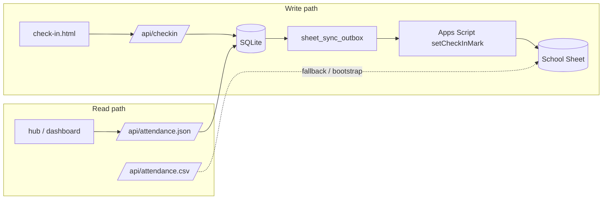

# Attendance database (source of truth)

Summer attendance is stored in **SQLite** on the ghfb container (`/data/attendance.db`, Docker volume `ghfb-data`). Coach check-in writes to the database first; the school Google Sheet is updated asynchronously as a secondary copy.

## Data flow



| Path | Role |
|------|------|
| **SQLite** | Source of truth for roster, session columns, and marks |
| **Coach check-in** | Reads/writes via `/api/checkin` → Python sidecar → SQLite |
| **Dashboard / hub** | Reads `/api/attendance.json` (15s cache); falls back to published CSV |
| **Google Sheet** | Secondary copy via `setCheckInMark`; still used for manual edits until fully migrated |

## Schema

| Table | Purpose |
|-------|---------|
| `seasons` | Program name + ironman threshold |
| `players` | Roster with legacy `sheet_row` for sheet sync |
| `session_columns` | Weightroom / conditioning / practice columns by date |
| `attendance_marks` | Player × session present flag |
| `sheet_sync_outbox` | Pending copies to Google Sheet |

## API

| Endpoint | Method | Purpose |
|----------|--------|---------|
| `/api/attendance.json` | GET | Full attendance grid for dashboard/hub |
| `/api/attendance/import` | POST | Re-import roster + marks from CSV (`{ "pin": "..." }`) |
| `/api/attendance/sync` | POST | Flush pending sheet sync jobs |
| `/api/checkin?action=getCheckInData` | GET | Today’s roster + marks (DB-backed) |
| `/api/checkin?action=toggleCheckIn` | GET | Toggle mark in DB + queue sheet sync |

When the DB is empty on first startup, the sidecar auto-imports from the published attendance CSV URL.

## Environment

| Variable | Default | Purpose |
|----------|---------|---------|
| `ATTENDANCE_DB_ENABLED` | `1` | Set `0` to fall back to sheet-only mode |
| `ATTENDANCE_DB_PATH` | `/data/attendance.db` | SQLite file location |
| `ATTENDANCE_SEASON_NAME` | `2026 Summer WR & Conditioning` | Season key |
| `ATTENDANCE_CSV_URL` | published sheet URL | Bootstrap / manual import source |
| `COACH_PIN` | empty | Optional PIN checked in Python + Apps Script |
| `CHECKIN_SCRIPT_URL` | deployed `/exec` URL | Sheet sync target |

## Operations

**Re-import after sheet structure changes** (new columns, roster edits):

```bash
curl -X POST https://ghfb.360web.cloud/api/attendance/import \
  -H 'Content-Type: application/json' \
  -d '{"pin":"YOUR_PIN"}'
```

**Flush sheet sync queue manually:**

```bash
curl -X POST https://ghfb.360web.cloud/api/attendance/sync \
  -H 'Content-Type: application/json' \
  -d '{"pin":"YOUR_PIN"}'
```

**Run unit tests:**

```bash
python3 server/test_attendance_db.py
```

## Apps Script

Deploy an updated web app after changing `Code.gs`. The new action **`setCheckInMark`** sets a cell to `X` or empty explicitly (used by sheet sync; avoids toggle drift).

## Migration path

1. Deploy this change — DB bootstraps from current sheet CSV.
2. Coach check-in uses DB immediately; sheet updates follow in background.
3. Dashboard/hub read from DB (`/api/attendance.json`).
4. When comfortable, stop relying on published CSV and eventually retire direct sheet writes.

See also [architecture.md](./architecture.md) and [flows-coach-check-in.md](./flows-coach-check-in.md).
