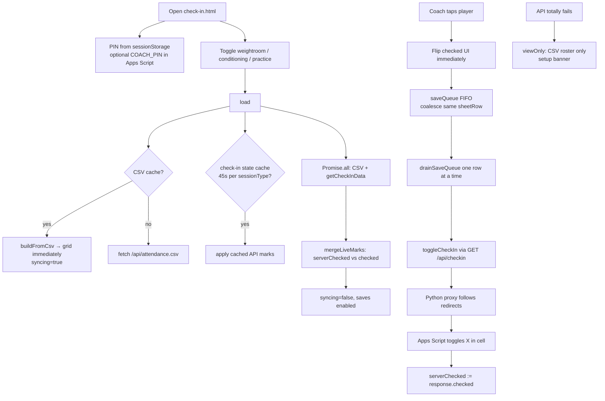
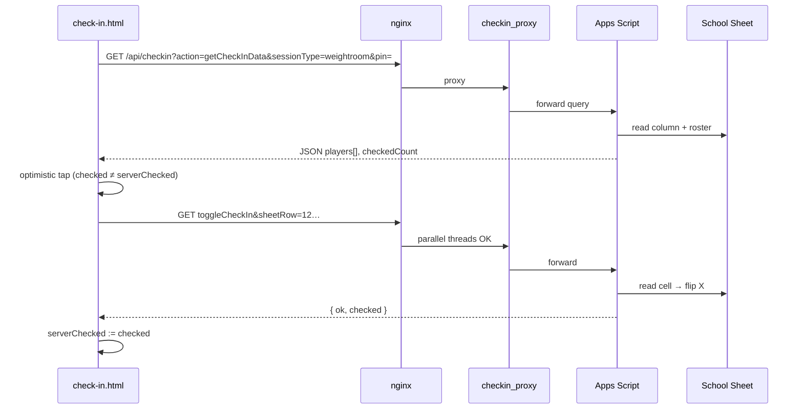

# Flow: Coach check-in

`check-in.html` lets coaches mark **weightroom**, **conditioning**, or **practice** (`P` column) attendance for today by tapping names. Writes go through `/api/checkin` → Python proxy → Apps Script → school sheet.

Entry: https://ghfb.360web.cloud/check-in.html  
Implementation: `js/check-in.js` (ES module) with `shared/ghfb-csv.js` and `shared/ghfb-attendance.js`.

## End-to-end diagram

## API sequence

## API actions

All requests use same-origin `GET /api/checkin?...` (`cache: no-store`). nginx sets `Cache-Control: no-store`.

| Action | Query params | Effect |
|--------|--------------|--------|
| `getCheckInData` | `sessionType`, `pin` | Roster + today’s marks for that session column |
| `toggleCheckIn` | `sheetRow`, `sessionType`, `pin` | Flip cell between `X` and empty |

Apps Script also supports `doPost` with JSON body for `toggleCheckIn`; the web UI uses GET via the proxy.

Optional script property **`COACH_PIN`**: if set, wrong PIN returns error from Apps Script.

## Client state

| State | Meaning |
|-------|---------|
| `checked` | What the coach sees (optimistic) |
| `serverChecked` | Last known value on the sheet |
| `syncing` | Initial load merging CSV + API (grid still tappable) |
| `viewOnly` | API unavailable; CSV roster only, no saves |

### Per-row UI labels

- **Checked in** — `checked === serverChecked` and checked
- **Queued…** — save pending for this row
- **Saving…** — `toggleCheckIn` in flight

### Save queue

- FIFO queue; rapid taps on the **same** `sheetRow` collapse to one pending job.
- Different players can be queued back-to-back; grid is never fully disabled during sync.
- On error, `checked` reverts to `serverChecked`.

### Caches

| Key | TTL | Purpose |
|-----|-----|---------|
| `ghfb-attendance-csv` | 3 min | Instant roster from CSV |
| Check-in state (per `sessionType`) | 45 s | Last `getCheckInData` payload |
| `ghfb-coach-pin` | session | PIN in sessionStorage |

## Why the Python proxy exists

Browsers cannot reliably call Apps Script `/exec` directly (redirects to `script.googleusercontent.com` caused DNS/CORS issues). The container sidecar follows redirects server-side and returns JSON to the page on the same origin.

Config: `deploy/checkin_proxy.py`, env `CHECKIN_SCRIPT_URL`. Legacy direct URL may still appear in `check-in-config.js` as `GHFB_CHECKIN_SCRIPT_URL`; production uses `/api/checkin` by default.

## Apps Script

Source: `scripts/coach-check-in/Code.gs`  
Setup: `scripts/coach-check-in/README.md`

After editing `Code.gs`: **Deploy → New version** on the web app (Save alone is not enough).

## Sheet model

Today’s columns: [sheet-model.md](./sheet-model.md).
