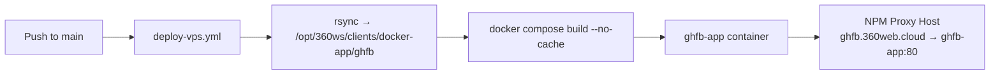

# Flow: Deploy and operations

## CI/CD pipeline



| Item | Value |
|------|-------|
| Workflow | `.github/workflows/deploy-vps.yml` |
| Trigger | Push to `main` / `master` (path filters) or `workflow_dispatch` |
| VPS path | `/opt/360ws/clients/docker-app/ghfb` |
| Container name | `ghfb-app` |
| Host port | `8020` → container `80` |
| Docker network | `360ws-network` |
| Secrets | `VPS_SSH_KEY`, `VPS_HOST`, `VPS_USER` |

Health check after deploy: `curl -fsS http://localhost:8020/`.

## Docker image

Built from `Dockerfile`:

- nginx Alpine + Python 3
- Copies root `*.html`, `js/`, `shared/`, `check-in-config.js`, `manifest.webmanifest`, `sw.js`, `icons/`, `images/`
- Runs `/opt/start-ghfb.sh` (proxy + nginx)

## Apps Script deploy (separate from ghfb)

1. Personal Google account project with `scripts/coach-check-in/Code.gs`.
2. School sheet shared with that account as **Editor**.
3. Set `SHEET_ID` in `Code.gs`.
4. Run `testSheetAccess` in the script editor.
5. **Deploy → New web app** (Execute as: Me, Who has access: Anyone with the link).
6. Ensure `CHECKIN_SCRIPT_URL` in the container matches the `/exec` URL (default in `checkin_proxy.py`).

## Local preview

```bash
cd ~/Projects/ghfb
open index.html

# Production-like stack:
docker compose -f docker-compose.prod.yml up --build
open http://localhost:8020/
open http://localhost:8020/attendance-dashboard.html
open http://localhost:8020/check-in.html
```

## NPM (one-time)

Proxy host: `ghfb.360web.cloud` → `http://ghfb-app:80` on `360ws-network`.  
DNS: A record to VPS.

## Operational checks

| Check | How |
|-------|-----|
| Hub up | `curl -fsS https://ghfb.360web.cloud/` |
| CSV proxy | `curl -sI https://ghfb.360web.cloud/api/attendance.csv` → look for `X-GHFB-Cache` |
| Check-in API | `curl -s "https://ghfb.360web.cloud/api/checkin?action=getCheckInData&sessionType=weightroom&pin="` |
| Sheet column for today | Apps Script `testSheetAccess` logs WR/conditioning column numbers |

After sheet column changes, coaches may need a new date + `C` headers before check-in succeeds for that day.
