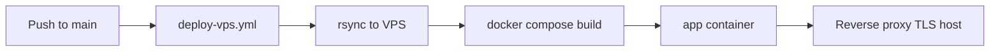

# Flow: Deploy and operations

## CI/CD pipeline



| Item | Description |
|------|-------------|
| Workflow | `.github/workflows/deploy-vps.yml` |
| Trigger | Push to `main` / `master` (path filters) or `workflow_dispatch` |
| Runtime | nginx static site + Python check-in sidecar |
| Network | Shared Docker reverse-proxy network with sibling app containers |
| Secrets | `VPS_SSH_KEY`, `VPS_HOST`, `VPS_USER` |

Health check after deploy: HTTP GET on the app root via the published host port.

## Docker image

Built from `Dockerfile`:

- nginx Alpine + Python 3
- Static hub pages, shared JS modules, PWA assets
- Reverse proxy routes for `/api/checkin`, `/api/attendance.csv`, `/lift/`, `/film/`, `/weightroom/`
- Runs `/opt/start-ghfb.sh` (check-in proxy + nginx)

## In-app sibling apps

| Path | Upstream container |
|------|-------------------|
| `/lift/` | `gh-lift` (gh-lift repo) |
| `/film/` | `flim-review-app` (flim-review repo) |
| `/weightroom/` | `weightroom-app` (team-weightroom-tracker repo, port 3000) |

All sibling containers must join the same Docker network as the hub container (`360ws-network`).

**Weightroom standalone:** NPM host `weightroom.360web.cloud` → `weightroom-app:3000` (same container; no path prefix).

## Apps Script deploy (separate from ghfb)

1. Personal Google account project with `scripts/coach-check-in/Code.gs`.
2. School sheet shared with that account as **Editor**.
3. Set `SHEET_ID` in `Code.gs`.
4. Run `testSheetAccess` in the script editor.
5. **Deploy → New web app** (Execute as: Me, Who has access: Anyone with the link).

## Local preview

```bash
cd ~/Projects/ghfb
docker compose -f docker-compose.prod.yml up --build
open http://localhost:8020/
```

## Operational checks

| Check | Expected |
|-------|----------|
| Hub | Root URL returns 200 |
| CSV proxy | `/api/attendance.csv` returns CSV |
| Check-in API | `/api/checkin?action=getCheckInData&sessionType=weightroom` returns JSON |
| In-app Lift | `/lift/` returns GH Lift UI |
| In-app Film | `/film/` returns season selector |
| In-app Weightroom | `/weightroom/` returns Weightroom Tracker SPA |
| Standalone Weightroom | `weightroom.360web.cloud` returns same app at `/` |

After sheet column changes, coaches may need a new date + `C` headers before check-in succeeds for that day.
