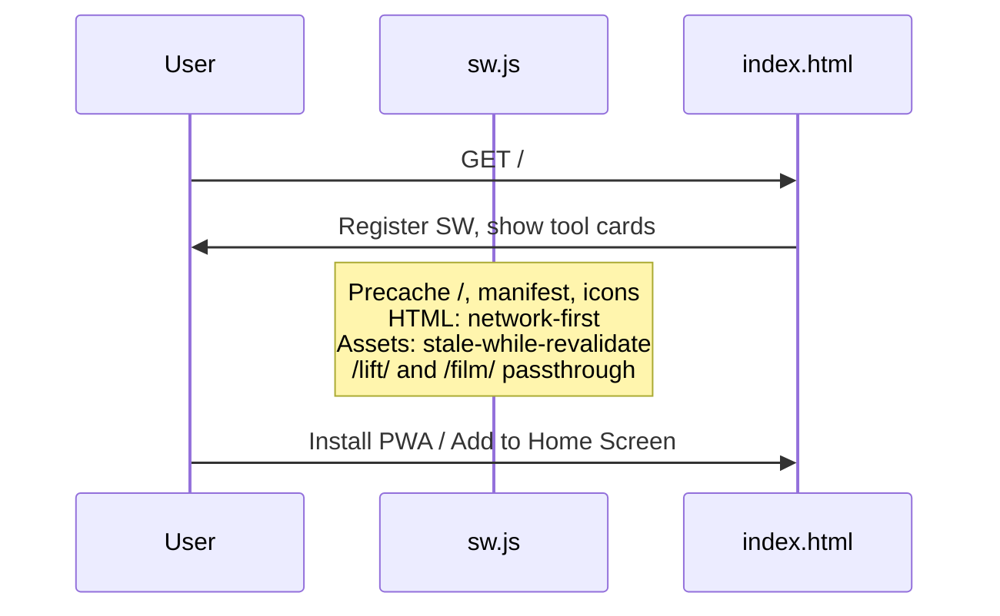

# Flow: Hub and PWA

The team tools landing page (`index.html`) is a static hub with no backend calls. It can be installed as a progressive web app.

## Sequence

## Service worker (`sw.js`)

| Behavior | Applies to |
|----------|------------|
| **Precache on install** | `/`, `/index.html`, manifest, icons |
| **Network-first** | HTML / navigation (fresh hub when online) |
| **Stale-while-revalidate** | Same-origin static assets |
| **Passthrough** | Cross-origin (Google, fonts); `/lift/` and `/film/` proxied apps |
| **Not intercepted** | `/lift/*`, `/film/*` — sibling apps handle their own caching |

Cache name: `ghfb-hub-v8` (bump when precache list changes).

## In-app proxied apps

GH Lift and Film Review open at `/lift/` and `/film/` on the same origin so the installed PWA does not jump to Safari/Chrome. nginx reverse-proxies to sibling Docker containers; the hub service worker does not cache those paths.

Google Form and Team Drive still open externally (`target="_blank"`).

## Hub page logic

- Renders tool cards; Lift and Film use in-app paths.
- Footer season label from visitor local date.
- Optional install banner when `beforeinstallprompt` fires and app is not already standalone.

## Related docs

- Outbound URLs: [sitemap.md](./sitemap.md)
- Deploy of `sw.js` / icons: [flows-deploy.md](./flows-deploy.md)
