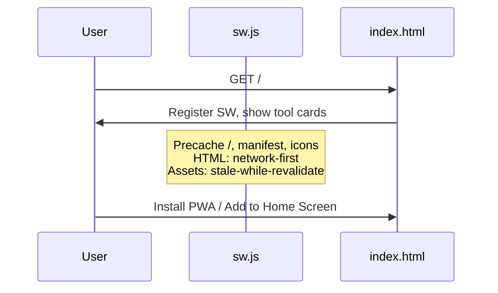

# Flow: Hub and PWA

The team tools landing page (`index.html`) is a static hub with no backend calls. It can be installed as a progressive web app.

## Sequence

## Service worker (`sw.js`)

| Behavior | Applies to |
|----------|------------|
| **Precache on install** | `/`, `/index.html`, manifest, icons |
| **Network-first** | HTML / navigation (fresh hub when online) |
| **Stale-while-revalidate** | Same-origin static assets |
| **Passthrough** | Cross-origin (Google, fonts, external apps) |

Cache name: `ghfb-hub-v6` (bump when precache list changes).

## Hub page logic

- Renders seven tool cards (film, lift, check-in, form, dashboard, schedule, drive).
- Footer season label from visitor local date: Winter (Dec–Feb), Spring (Mar–May), Summer (Jun–Aug), Fall (Sep–Nov).
- Optional install banner when `beforeinstallprompt` fires and app is not already standalone.

## Related docs

- Outbound URLs: [sitemap.md](./sitemap.md)
- Deploy of `sw.js` / icons: [flows-deploy.md](./flows-deploy.md)
